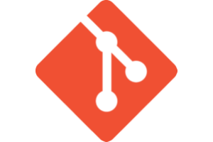

<!--- ABOUT ---------------------------------------------------------------------------------------------------------------->
<h1 align="center">
  Hey there  I'm Jonathan...
</h1>

  I'm a multimedia professional turned software developer. 
  After a decade in the entertainment industry, I found my way into the technology sector.

  <a href="https://credentials.uipath.com/e3a5ecc3-c0cb-4880-9e05-c022083d002c#gs.2xxlvs" target="_blank">
  

  I specialize in <b>Robotic Process Automation</b> with an Associate-level certification in UiPath and their suite of applications.

  I help companies save time, money, and effort by building automated software solutions for manual and repetitive business processes that minimize human error, maximize productivity, and enable business professionals to focus more on value-driven work.

<!--- CURRENT WORK ---------------------------------------------------------------------------------------------------------->
<h2 align="center">
  Tech Stack
</h2>

  Here are the applications and tools that I've been learning and utilizing throughout the last 3+ years...

   &emsp;
   &emsp;
   &emsp;
  

   &emsp;
   &emsp;
  

<!--- PRIOR WORK ------------------------------------------------------------------------------------------------------------>
<h2 align="center">
  Prior Work
</h2>

  I'm a Veteran of the United States Air Force with 6 years of military service.

  

  I've had the pleasure of working with the following organizations throughout my 10 years in the entertainment industry...

   &emsp;
   &emsp;
   &emsp;
  

   &emsp;
   &emsp;
   &emsp;
   &emsp;
   &emsp;
  

<!--- CONNECT --------------------------------------------------------------------------------------------------------------->
<h2 align="center">
  Want to Connect?
</h2>

  If you like what you see, then let's have a conversation...

   &emsp;
   &emsp;
  

  Thanks for stopping by!

